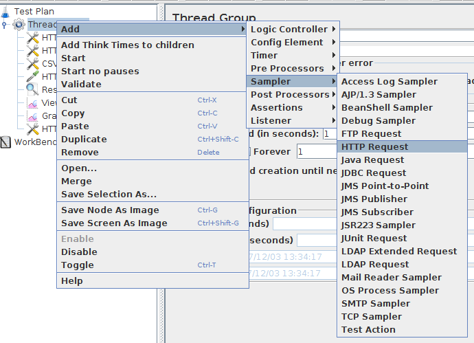
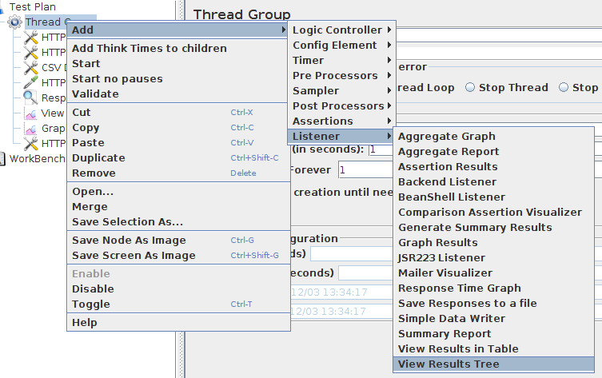
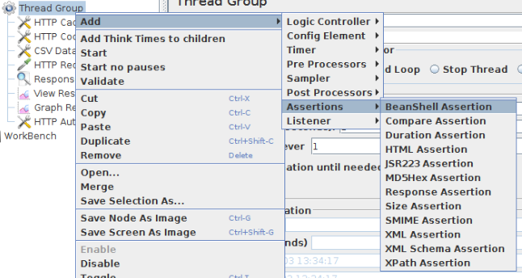

# Jmeter examples
Jmeter is typical NFT tool and can verify external(or internal) system is working the way expected without any Testing Code.

## Typical Process
1. Create a Thread Group (TestPlan must be already there)
2. Add Sampler
3. Add Listener
4. Run Test

Above is pretty much the most basic flow.

And we can have A LOT more options here and there. Assertions can be added to verify the test result.  

### Sampler
Main test point here. This will have what you are going to test.

- HTTP Request
- LDAP Request
- and more (SMTP, TCP ...)

### Listener
You can see what has happened through your test here. 

- View Results in Table
- View Results Tree
- Graph Results
- and more (Assertion Results,Response Time Graph)

### Assertions
You can put assertions here to verify what your test produced are same as expected response data or the test was finished within certain duration.

- Duration Assertion
- HTML Assertion
- Response Assertion
- XML Assertion
- and more (XPath, Size ...)